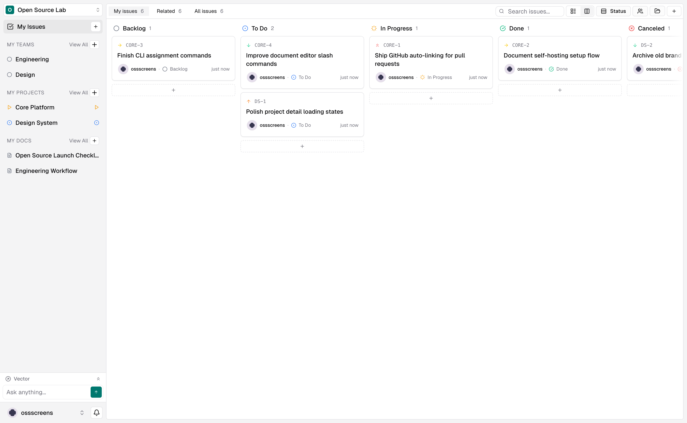
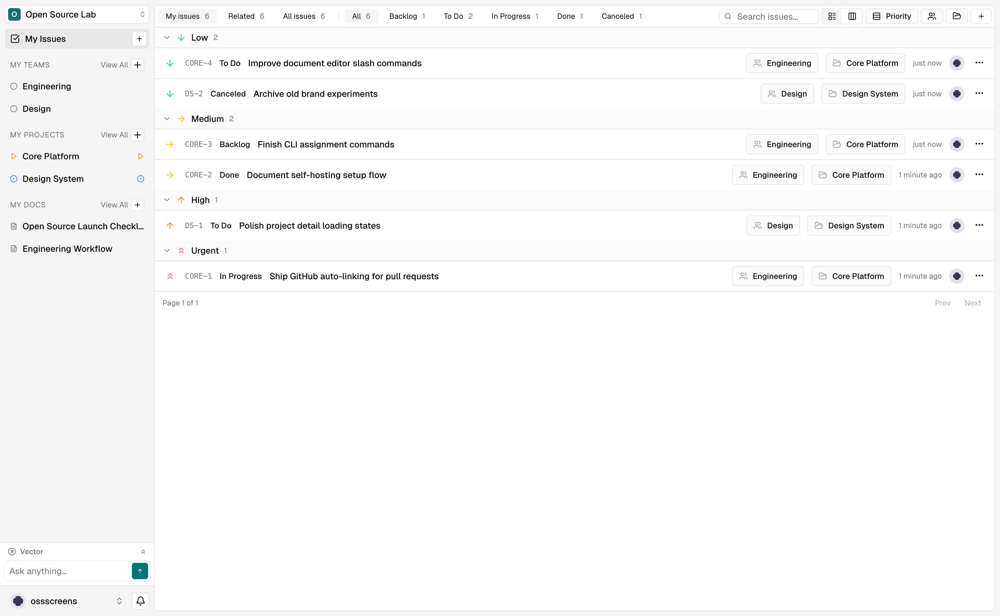
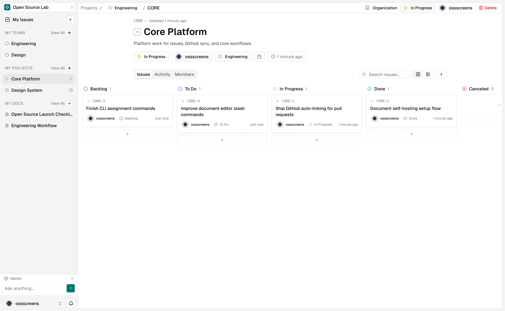
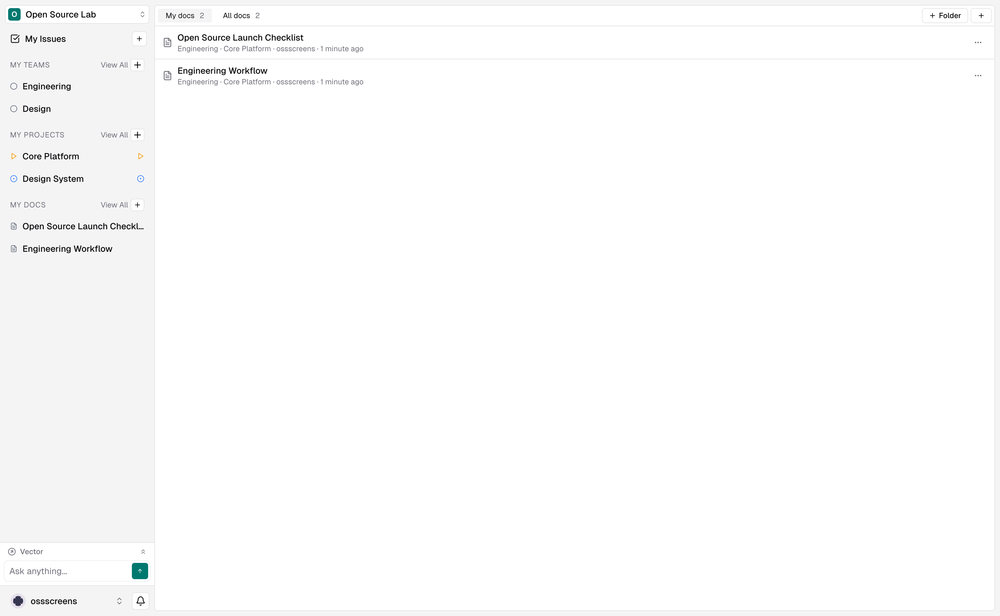
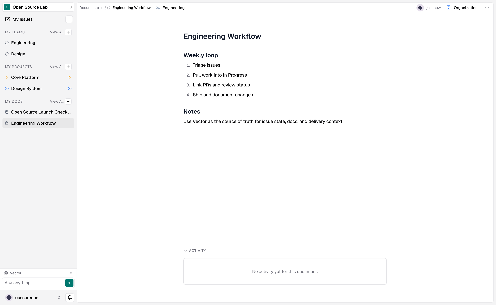

# Vector

Vector is an open source project management platform built with Next.js, Convex, and Better Auth. It is designed for teams that want projects, issues, permissions, and organization-level workflows in one codebase.



## Features

- Multi-tenant organizations and workspaces
- Projects, issues, teams, and role-based permissions
- Kanban and table views for issue tracking
- Rich document editor with markdown, mentions, and slash commands
- Real-time data updates with Convex
- Better Auth integration with Convex-backed user data
- Type-safe frontend and backend with TypeScript

## Screenshots

<details>
<summary>Issues — Table View</summary>



</details>

<details>
<summary>Project Detail</summary>



</details>

<details>
<summary>Documents</summary>



</details>

<details>
<summary>Document Editor</summary>



</details>

## Stack

- Next.js 16 and React 19
- Convex for database, functions, realtime, and storage
- Better Auth with the Convex adapter
- Tailwind CSS v4, Radix UI, and shadcn/ui
- ESLint, Prettier, Husky, and pnpm

## Project Status

Vector is under active development. The top-level docs in this repository reflect the current contributor workflow. Some files under `docs/migration/` remain as historical implementation notes from earlier architecture work and should not be treated as onboarding documentation.

## Quick Start

1. Install dependencies.

   ```bash
   pnpm install
   ```

2. Create local environment variables.

   ```bash
   cp sample.env .env.local
   ```

3. Update `.env.local` with your local values.

   Minimum local setup usually includes:
   - `NEXT_PUBLIC_APP_URL=http://localhost:3000`
   - `BETTER_AUTH_SECRET=<your-secret>`
   - `NEXT_PUBLIC_CONVEX_URL=<your-local-convex-url>`

4. Start Convex in one terminal.

   ```bash
   pnpm run convex:dev
   ```

5. Start Next.js in another terminal.

   ```bash
   pnpm run dev
   ```

6. Open `http://localhost:3000`.

   On a fresh local instance, visit `/setup-admin` to create the first administrator account.

## Environment Variables

Copy `sample.env` to `.env.local` and update the values. For local development, both Next.js and Convex read from the same root env files, so one `.env.local` is enough. For production, split variables by the runtime that actually reads them.

### Set In Next.js Environment (`.env.local`, Vercel)

| Variable                       | Why it belongs here                                                                |
| ------------------------------ | ---------------------------------------------------------------------------------- |
| `NEXT_PUBLIC_CONVEX_URL`       | Read by the browser Convex providers and Next.js server code that talks to Convex. |
| `CONVEX_SITE_URL`              | Read by `src/lib/auth-server.ts` on the Next.js server for auth helper requests.   |
| `NEXT_PUBLIC_CONVEX_SITE_URL`  | Fallback for `CONVEX_SITE_URL` in `src/lib/auth-server.ts`.                        |
| `NEXT_PUBLIC_VAPID_PUBLIC_KEY` | Read in browser push-subscription code.                                            |

### Set In Convex Environment

| Variable                      | Why it belongs here                                                                                                                                                                      |
| ----------------------------- | ---------------------------------------------------------------------------------------------------------------------------------------------------------------------------------------- |
| `BETTER_AUTH_SECRET`          | Read in `convex/auth.ts` to sign Better Auth tokens and encrypt JWKS private keys.                                                                                                       |
| `AUTH_SECRET`                 | Optional fallback for `BETTER_AUTH_SECRET` in `convex/auth.ts`.                                                                                                                          |
| `JWKS`                        | JSON Web Key Set used by Better Auth. Set to `{}` to auto-generate. Must match the current `BETTER_AUTH_SECRET` — if you rotate the secret, clear this to `{}` so keys are re-generated. |
| `NEXT_PUBLIC_APP_URL`         | Read in `convex/auth.ts` as the Better Auth base URL.                                                                                                                                    |
| `NEXT_PUBLIC_SITE_URL`        | Optional fallback for `NEXT_PUBLIC_APP_URL` in `convex/auth.ts`.                                                                                                                         |
| `BETTER_AUTH_TRUSTED_ORIGINS` | Read in `convex/auth.ts` for the auth callback allowlist.                                                                                                                                |
| `SMTP_HOST`                   | SMTP server hostname for sending emails (OTP codes and notifications).                                                                                                                   |
| `SMTP_PORT`                   | SMTP port (default `587`, use `465` for SSL).                                                                                                                                            |
| `SMTP_USER`                   | SMTP username for authentication.                                                                                                                                                        |
| `SMTP_PASS`                   | SMTP password for authentication.                                                                                                                                                        |
| `SMTP_FROM`                   | Sender address for outgoing emails, e.g. `Vector <noreply@yourdomain.com>`. Falls back to `SMTP_USER` if not set. Must be a valid email or `Name <email>` format.                        |
| `VAPID_PUBLIC_KEY`            | Read in `convex/notifications/actions.ts` for push delivery.                                                                                                                             |
| `VAPID_PRIVATE_KEY`           | Read in `convex/notifications/actions.ts` for push delivery.                                                                                                                             |
| `VAPID_SUBJECT`               | Read in `convex/notifications/actions.ts` for push delivery.                                                                                                                             |

`NEXT_PUBLIC_APP_URL` and `NEXT_PUBLIC_SITE_URL` have a public-looking prefix, but they are currently consumed by Convex auth code rather than browser code.

### Local CLI / Convex Tooling Only

| Variable            | Why it belongs here                                                                            |
| ------------------- | ---------------------------------------------------------------------------------------------- |
| `CONVEX_URL`        | Used by `scripts/run-permission-migrations.ts` when invoking `pnpm convex run`.                |
| `CONVEX_ADMIN_KEY`  | Only needed by `scripts/run-permission-migrations.ts` for admin-only migrations.               |
| `CONVEX_DEPLOYMENT` | Managed by the Convex CLI during local development. It is not read by the application runtime. |

## Development

- `pnpm run dev` starts the Next.js development server
- `pnpm run convex:dev` runs the local Convex backend and code generation
- `pnpm run lint` runs ESLint
- `pnpm run build` builds the production app
- `pnpm run format` formats the repository with Prettier

## Documentation

- Contributor docs: [docs/index.md](docs/index.md)
- Local setup: [docs/getting-started/01-local-setup.md](docs/getting-started/01-local-setup.md)
- Environment variables: [docs/getting-started/02-environment-variables.md](docs/getting-started/02-environment-variables.md)
- Common commands: [docs/getting-started/04-common-commands.md](docs/getting-started/04-common-commands.md)

## Contributing

Contributions are welcome. Start with [CONTRIBUTING.md](CONTRIBUTING.md), then check [CODE_OF_CONDUCT.md](CODE_OF_CONDUCT.md) and [SECURITY.md](SECURITY.md) for the expected collaboration and reporting process.

## License

This project is licensed under the Apache License 2.0. See [LICENSE](LICENSE).
